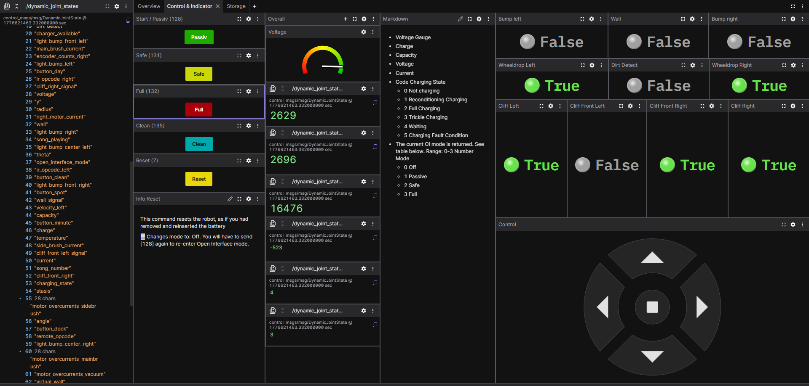

# Roomba Hardware Interface and ROS2 Controller

This project implements a ROS2 hardware interface and controller for the iRobot® Roomba® using the Serial Command Interface (SCI) specification. It provides a seamless way to control Roomba's movement via the Diff Drive Controller in ROS2.
Make sure to use the right branch for your version. Currently available: 500er and 600er.

Provided: Foxglove layout

## Features

Interface to control Roomba's velocity using ROS2 messages.

Compatible with ROS2-based systems.

Can be used to send commands to Roomba for movement control. Different controllers can be used.

Utilizes the iRobot® Roomba® Serial Command Interface (SCI) for communication.

## Requirements

ROS2 (e.g., Foxy, Galactic, or Humble)

iRobot® Roomba® with SCI support

A working serial connection between the host computer and Roomba.

## Setup and Installation
1. Clone the repository
```md
git clone https://github.com/TaylorDelta/RoombaRos2Control.git
cd roomba_ros2_controller
```

3. Install dependencies

Install necessary ROS2 dependencies for your workspace:
```md
sudo apt update
sudo apt install ros-<ros2-distro>-serial
sudo apt install ros-<ros2-distro>-rosbridge-server
```
3. Build the workspace

From your ROS2 workspace, build the project:
```md
colcon build
```
4. Source the workspace

After building, source the workspace to ensure that ROS2 can find the packages:
```md
source install/setup.bash
```
Launch the Roomba Controller

To launch the hardware interface and controller, run the following command:
```md
ros2 launch robot_bringup robot_x.launch.py
```

This will start the necessary ROS2 nodes for controlling your Roomba robot.

## Sending Commands to Roomba

You can use the Diff Drive Controller to send movement commands to Roomba. To send a command, run the following command in a separate terminal:
```md
ros2 topic pub /diff_drive_controller/cmd_vel geometry_msgs/msg/TwistStamped "{header: {stamp: {sec: 0, nanosec: 0}, frame_id: 'base_link'}, twist: {linear: {x: 0.1, y: 0.0, z: 0.0}, angular: {x: 0.0, y: 0.0, z: 0.2}}}" -r 10
```
This results in the Roomba driving a circle with diameter of 1m at a speed of 100mm/s

## Foxglove (Helpfull Webcontrol)
Make sure Foxglove Bridge is installed in your ROS2 workspace:
```md
sudo apt install ros-${ROS_DISTRO}-foxglove-bridge
```
Start the ROS2 ↔ Foxglove WebSocket bridge
```md
ros2 launch foxglove_bridge foxglove_bridge_launch.xml port:=8765
```

Foxglove needs geometry_msgs/msg/Twist, the controller wants geometry_msgs/msg/TwistStamped, so twist_bridge creates /cmd_vel_fg without stamped
```md
ros2 run twist_bridge twist_to_stamped
```

## Troubleshooting

Ensure that the serial connection between the computer and Roomba is properly established.

Verify that the correct serial port is being used in the launch files.

If you encounter a problem that isn’t already documented, please create a new issue. Make sure to clearly describe the problem, steps to reproduce it, and any relevant error messages.

## License

This project is licensed under the Apache 2.0 License - see the LICENSE
 file for details.

## Acknowledgments

The iRobot® Roomba® Serial Command Interface (SCI) Specification

ROS2 and the ROS community for providing an open-source platform for robotics development.

This project uses code from [RosTeamWorkspace](https://github.com/b-robotized/ros_team_workspace), licensed under the Apache License 2.0.


